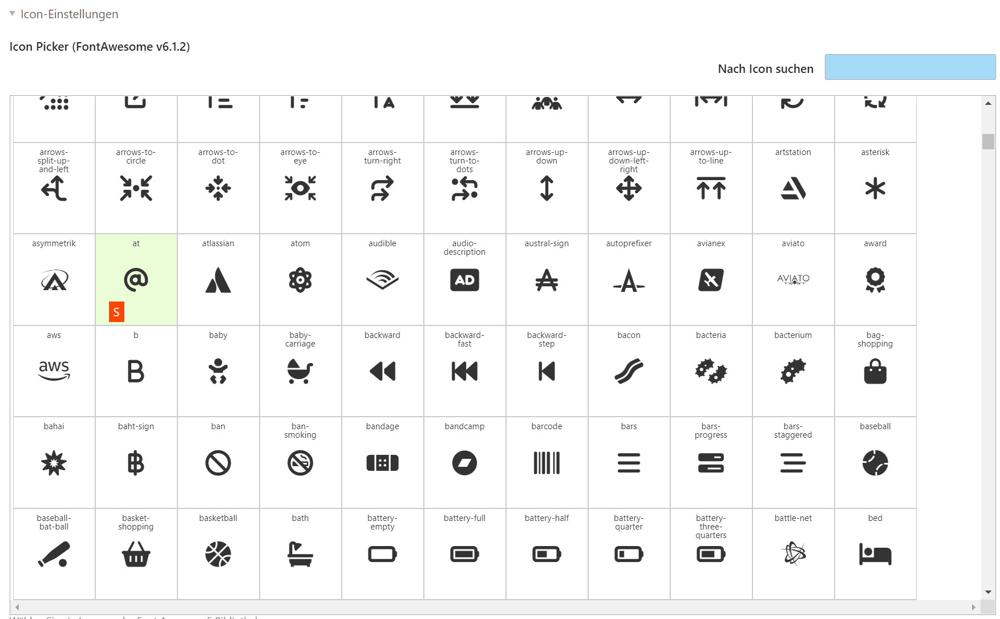

# Font Awesome 5 Icon Picker Contao Backend Widget


## Configuration
Configuration is done in `config/config.yaml`

```yaml
markocupic_fontawesome_icon_picker:
    # Get your free kit code at https://fontawesome.com/start
    fontawesome_source_path: 'https://kit.fontawesome.com/12345sdf65.js'
    # Configure styles.
    fontawesome_styles:
        fas: fa-solid
        far: fa-regular
        fal: fa-light
        fab: fa-brands
        fad: fa-duotone
        fat: fa-thin
    # Add the path to your custom fontawesome icons meta file.
    fontawesome_meta_file_path: 'files/fontawesome/metadata/icons.yml'

```
